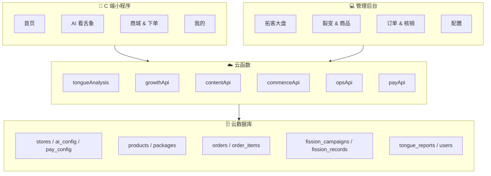
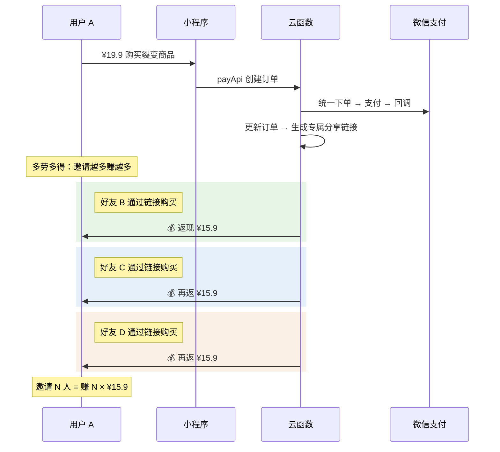

# 🚀 拓客小程序 · 实施方案

> 自建订单 + 微信支付 API，不使用交易组件

## 系统全景



## 裂变返现流程



---

## Proposed Changes

### 📱 小程序 C 端

````carousel
#### [NEW] [app.json](file:///Users/gongyaming/Desktop/裂变小程序/miniapp/app.json) · [app.js](file:///Users/gongyaming/Desktop/裂变小程序/miniapp/app.js) · [app.wxss](file:///Users/gongyaming/Desktop/裂变小程序/miniapp/app.wxss)

**应用基座**

| 文件 | 职责 |
|---|---|
| `app.json` | 页面路由、云开发启用 |
| `app.js` | 云开发初始化、登录态、分享来源追踪 |
| `app.wxss` | 设计系统（主题色、字体、组件样式） |
<!-- slide -->
#### [NEW] [pages/index/](file:///Users/gongyaming/Desktop/裂变小程序/miniapp/pages/index/)

**首页** — 流量入口

- 门店 Logo / 名称 / 地址导航
- Banner 轮播（后台可配）
- 🔥 裂变活动卡片（最醒目位置）
- 🔮 AI 看舌象大按钮入口
- 商品精选推荐
<!-- slide -->
#### [NEW] [pages/tongue/](file:///Users/gongyaming/Desktop/裂变小程序/miniapp/pages/tongue/) · [pages/tongue-report/](file:///Users/gongyaming/Desktop/裂变小程序/miniapp/pages/tongue-report/)

**AI 看舌象**

| 页面 | 功能 |
|---|---|
| `tongue/` | 拍照引导、上传、调用云函数 |
| `tongue-report/` | 报告展示、产品推荐、分享卡片生成 |

云函数读取 `ai_config` → 转发 AI API → 报告存入 `tongue_reports`
<!-- slide -->
#### [NEW] [pages/mall/](file:///Users/gongyaming/Desktop/裂变小程序/miniapp/pages/mall/) · [pages/product-detail/](file:///Users/gongyaming/Desktop/裂变小程序/miniapp/pages/product-detail/)

**轻量商城** — 自建订单 + 微信支付 API

| 页面 | 功能 |
|---|---|
| `mall/` | 商品列表（实物/服务/套餐 Tab），裂变商品标「返 ¥XX」 |
| `product-detail/` | 图文详情、选规格、调用 `payApi` 云函数下单支付 |

支付流程：`payApi` 云函数 → 微信统一下单 API → 返回支付参数 → `wx.requestPayment`
<!-- slide -->
#### [NEW] [pages/fission/](file:///Users/gongyaming/Desktop/裂变小程序/miniapp/pages/fission/) · [pages/package-usage/](file:///Users/gongyaming/Desktop/裂变小程序/miniapp/pages/package-usage/)

**裂变 & 核销**

| 页面 | 功能 |
|---|---|
| `fission/` | 专属分享码、返现进度、邀请记录、一键分享 |
| `package-usage/` | 套餐列表、剩余次数、核销二维码、核销历史 |
<!-- slide -->
#### [NEW] [pages/profile/](file:///Users/gongyaming/Desktop/裂变小程序/miniapp/pages/profile/)

**个人中心**

- 订单记录
- 💰 返现余额 & 明细
- 👥 邀请记录
- 📋 舌象报告历史
- 🎫 套餐剩余次数
````

---

### ☁️ 云函数

| 云函数 | 核心逻辑 |
|---|---|
| [tongueAnalysis](file:///Users/gongyaming/Desktop/裂变小程序/miniapp/cloudfunctions/tongueAnalysis/) | 读取 `ai_config` → 转发 AI API → 解析 JSON → 存报告 → 检查额度 |
| [growthApi](file:///Users/gongyaming/Desktop/裂变小程序/miniapp/cloudfunctions/growthApi/) | AI 报告读取、抽奖、核销清单、返现记录、裂变邀约来源 |
| [contentApi](file:///Users/gongyaming/Desktop/裂变小程序/miniapp/cloudfunctions/contentApi/) | 首页/商城内容获取、活动位配置、商品列表透传 |
| [commerceApi](file:///Users/gongyaming/Desktop/裂变小程序/miniapp/cloudfunctions/commerceApi/) | 商品详情、订单创建、下单支付发起、订单与退款申请 |
| [opsApi](file:///Users/gongyaming/Desktop/裂变小程序/miniapp/cloudfunctions/opsApi/) | 工作台角色/权限、订单与核销查询、客户跟进、员工管理、后台配置 |
| [payApi](file:///Users/gongyaming/Desktop/裂变小程序/miniapp/cloudfunctions/payApi/) | 读取 `pay_config` → 微信统一下单 → 返回支付参数 → 处理回调与退款 |

> [!IMPORTANT]
> [!IMPORTANT]
> 本方案已完成到 2.0 聚合架构：旧版分散云函数已退出线上运行入口，仅保留为历史归档参考。

---

### 💻 管理后台

````carousel
#### [NEW] [pages/dashboard/](file:///Users/gongyaming/Desktop/裂变小程序/miniapp/pages/workbench/dashboard/)

**🎯 拓客大盘（首页）**

```
╔══════════════════════════════════════════╗
║         🚀 今日拓客数据                    ║
╠═══════════╦═══════════╦══════════════════╣
║ 新增客户    ║ 裂变订单    ║ 已返现金额       ║
║   +23      ║   47      ║  ¥748.3         ║
╠═══════════╩═══════════╩══════════════════╣
║ 📈 7天客户增长趋势                         ║
╠══════════════════════════════════════════╣
║ 🔥 进行中的裂变活动                        ║
║  祛湿体验装 ¥19.9 | 已售247 | 新客189人    ║
╚══════════════════════════════════════════╝
```
<!-- slide -->
#### [NEW] [pages/fission/](file:///Users/gongyaming/Desktop/裂变小程序/miniapp/pages/workbench/campaigns/)

**裂变活动管理**

| 配置项 | 说明 |
|---|---|
| 关联商品 | 从商品库选择 |
| 活动价 | 如 ¥19.9 |
| 返现金额 | 如 ¥15.9 |
| 限购数量 | 每人 1 份 |
| 活动库存 / 时间 | 总量 & 起止 |
| 返现方式 | 余额 |
<!-- slide -->
#### [NEW] [pages/products/](file:///Users/gongyaming/Desktop/裂变小程序/miniapp/pages/workbench/catalog/) · [pages/packages/](file:///Users/gongyaming/Desktop/裂变小程序/miniapp/pages/workbench/catalog/)

**商品 & 套餐**

| 模块 | 功能 |
|---|---|
| 商品管理 | CRUD、分类（实物/服务/套餐）、上下架 |
| 套餐配置 | 服务项 × 次数 |
| 核销记录 | 查看使用进度 |
<!-- slide -->
#### [NEW] [pages/ai-config/](file:///Users/gongyaming/Desktop/裂变小程序/miniapp/pages/workbench/settings/) · [pages/pay-config/](file:///Users/gongyaming/Desktop/裂变小程序/miniapp/pages/workbench/settings/) · [pages/orders/](file:///Users/gongyaming/Desktop/裂变小程序/miniapp/pages/workbench/orders/) · [pages/settings/](file:///Users/gongyaming/Desktop/裂变小程序/miniapp/pages/workbench/settings/)

**配置 & 管理**

| 模块 | 功能 |
|---|---|
| AI 舌象配置 | API 地址/密钥/模型、提示词、额度、测试连接 |
| 支付配置 | 微信支付商户号、商户密钥、证书上传 |
| 订单管理 | 订单列表、状态流转、退款处理 |
| 门店设置 | 名称、Logo、地址、Banner |
````

---

## Verification Plan

| 验证项 | 方法 |
|---|---|
| 微信支付 | 沙箱环境测试：下单 → 支付 → 回调 → 订单状态更新 |
| 裂变流程 | 模拟：A 购买 → 分享 → B 购买 → A 返现到账 |
| AI 流程 | 拍照 → 云函数转发 → 报告渲染 → 分享卡片 |
| 核销流程 | 套餐购买 → 核销码 → 扫码扣次 |
| 管理后台 | 浏览器验证所有页面 CRUD 和数据展示 |
