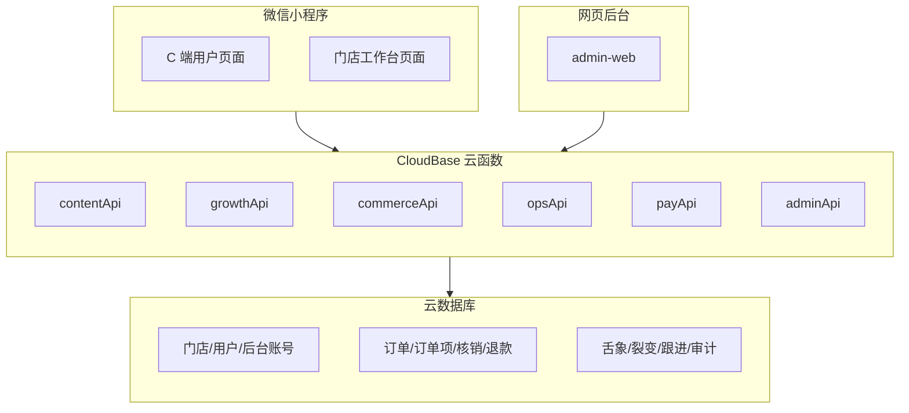

# 拓客小程序 2.0 实施概览

> 更新日期：2026-04-16
> 本文档从“待实施方案”调整为“2.0 当前架构与交付概览”，用于帮助交接和部署，不再沿用早期 `tongueAnalysis` 等旧架构描述。

## 系统全景



## 当前 2.0 结构

### 1. 微信小程序

#### C 端页面

- `pages/index`
- `pages/tongue`
- `pages/tongue-report`
- `pages/mall`
- `pages/product-detail`
- `pages/cart`
- `pages/orders`
- `pages/fission`
- `pages/lottery`
- `pages/package-usage`
- `pages/profile`

#### 工作台页面

- `pages/workbench/dashboard`
- `pages/workbench/orders`
- `pages/workbench/verify`
- `pages/workbench/campaigns`
- `pages/workbench/catalog`
- `pages/workbench/leads`
- `pages/workbench/staff`
- `pages/workbench/settings`

#### 小程序基座

- `miniapp/app.js`：云开发初始化、用户建档、邀请关系补绑、工作台权限入口
- `miniapp/app.json`：页面注册与 Tab 栏
- `miniapp/app.wxss`：全局 Token 与样式基座

### 2. 云函数分工

| 云函数 | 当前职责 |
|---|---|
| `contentApi` | 首页和商城内容、活动位、商品列表 |
| `growthApi` | 舌象记录、裂变收入、抽奖、套餐相关增长能力 |
| `commerceApi` | 商品详情、创建订单、我的订单、退款申请 |
| `opsApi` | 工作台订单、核销、员工、线索、设置、工作台概览 |
| `payApi` | 支付创建、支付回调、退款执行、内部回调鉴权 |
| `adminApi` | 网页后台会话、订单、活动、商品、客户、财务、运维 |

说明：

- 早期的 `tongueAnalysis` 旧入口不再是当前 2.0 主结构的一部分。
- 2.0 当前主线是聚合式云函数架构，而不是页面一一对应的分散函数架构。

### 3. 网页后台

当前 `admin-web` 已包含：

- 登录页与权限路由守卫
- 仪表盘
- 订单与退款审核
- 网页核销台
- 商品与套餐
- 裂变活动
- 线索/客户
- 员工与角色模板
- 设置
- 财务
- 运维/审计

## 关键业务链路

### 1. 下单支付链路

1. 用户在 `mall` / `product-detail` / `cart` 发起下单
2. `commerceApi` 创建订单与订单项
3. `payApi` 生成支付参数
4. 小程序执行 `wx.requestPayment`
5. `payApi` 处理支付回调并回写订单状态

### 2. 退款链路

1. 用户在订单页发起退款申请
2. `commerceApi` 写入 `refund_requests` 并将订单置为 `refund_requested`
3. 工作台或后台审核后，状态进入 `refunding`
4. `payApi` 或后台退款流程执行退款
5. 退款完成后订单进入 `refunded`

### 3. 套餐核销链路

1. 用户购买服务或套餐
2. 订单项写入 `verifyCode`
3. 工作台或网页核销台查询核销码
4. `opsApi` 执行扣次并写入 `package_usage`
5. 订单详情和履约记录可回看核销过程

### 4. 裂变链路

1. 用户通过分享进入小程序
2. `app.js` 记录或补绑邀请关系
3. 被邀请用户下单
4. 裂变记录进入 `fission_records`
5. 邀请收益在个人中心和相关运营视图中可见

## 当前实施状态

### 已落地

- 小程序 C 端主链路
- 门店工作台主链路
- 网页后台主链路
- 支付回调鉴权和退款状态机收口
- 多门店隔离
- 权限收敛与默认拒绝
- 核销台与订单履约明细
- 仓库级回归测试

### 仍需继续确认

- 真机全链路验收
- 真实支付与退款联调
- 环境变量与部署方式统一
- 首个后台管理员初始化流程
- 生产环境发布与回滚手册

## 当前验证基线

已执行仓库级测试：

```bash
node --test tests/*.test.js
```

结果：`108/108` 通过。

这代表代码基线稳定，但不代表生产环境已完成上线验收。

## 推荐阅读顺序

1. `docs/progress.md`
2. `docs/runbook.md`
3. `docs/deployment_guide.md`
4. `docs/admin-web-deploy.md`
5. `docs/database_schema.md`
6. `docs/go-live-checklist.md`
