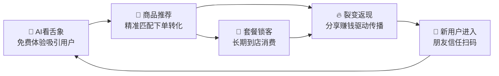

# 🚀 门店拓客神器 · 智能小程序系统

> **AI赋能 × 裂变增长 × 一键部署**
> 专为小儿推拿/母婴健康门店打造的智能获客系统


---

## 🎯 一句话说清楚

**让你的客户帮你拉客户。**

传统获客：你花钱打广告 → 客户被动看到 → 进店率低。
我们的方式：客户主动分享 → 朋友信任购买 → 裂变式增长。

---

## 🔥 三大核心功能

### ① 裂变返现 —— 把每个客户变成推广员

```
宝妈小李花 ¥19.9 买了体验装
    ↓ 分享到宝妈群（30人）
8 人下单 → 小李赚到 ¥127.2 返现
    ↓ 这 8 人继续分享...
门店获得 8 个全新客户，成本仅 ¥15.9/人
```

| 对比 | 传统地推 | 裂变返现 |
|---|---|---|
| 获客成本 | ¥300~1000/人 | **¥15.9/人** |
| 客户动力 | 靠面子关系 | **真金白银** |
| 传播范围 | 门店周边 1km | **无限裂变** |
| 持续性 | 推一次就停 | **自动循环** |

> **客户为什么愿意分享？** 因为分享就能**立刻赚钱**——不是积分、不是优惠券，是真金白银到账户余额，可以继续消费或提现。

---

### ② AI 看舌象 —— 自带传播力的引流神器

利用最前沿的 **AI 人工智能技术**，用户拍一张舌头照片，系统立刻给出：

| 分析维度 | 内容示例 |
|---|---|
| 🔴 舌色 | 淡红 → 气血偏弱 |
| ☁️ 舌苔 | 黄腻 → 湿热内蕴 |
| 🔍 舌形 | 胖大有齿痕 → 脾虚湿盛 |
| 💧 润燥 | 干燥 → 阴虚津亏 |

**→ AI 综合体质判断 + 通俗解释 + 调理建议 + 精准产品推荐**

> [!TIP]
> **传播力有多强？** 试想你在朋友圈看到一个宝妈发了这条：
> *"刚在 XX 推拿的小程序上测了一下，AI 说我家宝宝湿气重，推荐了对应的调理方案，挺准的！你们也试试 👉"*
> 你会不会好奇？会不会想试？**绝大多数人都会。**

---

### ③ 套餐核销 —— 锁定客户长期到店

| 套餐示例 | 内容 | 门店收益 |
|---|---|---|
| 🌿 春季助长套餐 ¥699 | 药浴5次 + 推拿6次 + 敷贴9次 | 客户至少到店 **20次** |
| 🌸 月度调理卡 ¥1299 | 推拿8次 + 泡浴8次 + 敷贴12次 | 提前锁定 **¥1299收入** |
| ⭐ 体验套餐 ¥99 | 推拿1次 + 泡浴1次 | 到店后 **升单转化** |

**核销流程**：客户到店 → 出示小程序核销码 → 门店扫一扫 → 自动扣减次数
不需要手写记录、不需要打印卡片、永不出错。

---

## 💡 五大使用场景

### 场景一：社区地推 —— 一次地推，持续裂变一周

> 在小区门口摆摊："扫码免费给宝宝看舌象，AI 帮你分析体质！"
> 家长扫码测完 → 觉得准 → 顺手 ¥19.9 买了体验装 → 回家发到宝妈群 → 群里又来一波人

### 场景二：门店成交 —— 一个客户，带来 10 个新客户

> 客户等孩子做推拿时，顺手测了舌象 → AI 推荐调理套餐 → 当场下了 ¥699 → 分享到 3 个宝妈群

### 场景三：宝妈群运营 —— 一条消息，200 个新客户

> 群里发一条："限时活动！19.9 体验祛湿药浴包，分享好友还能赚 15.9！"
> 200 人群 → 30 人买 → 每人又发自己的群 → 三天卖出 200+ 份

### 场景四：老客户激活 —— 沉睡客户，瞬间激活

> 推送消息："好久不见！分享体验装给朋友，每人下单你赚 15.9 元"
> 利益驱动 >> 任何话术

### 场景五：异业合作 —— 双赢互导流

> 跟母婴店/幼儿园/早教机构合作：放你的小程序码 → 客户扫码体验 AI 看舌象 → 成交分润
> 对方零成本多了服务项目，你零成本多了获客渠道

---

## 🔄 增长飞轮：三大功能如何形成闭环



> **这不是一个「用了两天就扔」的小程序。**
> **这是一个自动运转的获客飞轮——一旦启动，永不停止。**

---

## ✅ 每个门店完全独立

| 项目 | 说明 |
|---|---|
| 🏪 **你的品牌** | 小程序就是你门店的名字、你的 Logo |
| 👥 **你的客户** | 所有客户数据归你所有，别人看不到 |
| 💰 **你的收入** | 钱直接到你的商户账户，不经过中间人 |
| ⚙️ **你的运营** | 想搞什么活动自己定，后台一键操作 |
| 🔒 **你的数据** | 独立云环境，数据安全隔离 |

---

## 📊 算一笔经济账

假设你的门店用我们的系统做一次裂变活动：

| 指标 | 数据 |
|---|---|
| 产品成本 | 药浴包 ¥4/份 |
| 活动售价 | ¥19.9 |
| 返现金额 | ¥15.9 |
| **每份利润** | **¥0**（不赔不赚） |
| 第一批种子客户 | 20 人 (你的老客户) |
| 平均每人分享带来 | 3 个新客户 |
| 一轮裂变新增客户 | **60 人** |
| 二轮裂变 (60×3) | **180 人** |
| **两轮裂变总新增** | **240 个真实付费客户** |
| 其中 10% 转化为长期客户 | **24 人** |
| 每人年消费 | ¥3000~8000 |
| **年增收** | **¥72,000 ~ ¥192,000** |

> [!IMPORTANT]
> **你花了 ¥0 的额外推广费用，换来了年增收 7~19 万的潜在客户群。**
> 传统做法需要花 ¥24,000~240,000 的广告费才能获得同样数量的客户。

---

## 🆚 和传统方案的对比

| 对比项 | 传统做法 | 🚀 我们的方案 |
|---|---|---|
| 获客方式 | 发传单、打广告 | **客户帮你裂变** |
| 获客成本 | ¥300~1000/人 | **¥15.9/人** |
| 客户动力 | 靠面子、靠关系 | **真金白银返现** |
| 线上能力 | 没有或者很弱 | **AI+裂变+商城** |
| 套餐管理 | 手写卡片易出错 | **自动核销** |
| 传播范围 | 门店周边 1km | **无限裂变** |
| 技术门槛 | 花几万找人开发 | **我们搞定一切** |
| 数据归属 | 平台控制 | **完全归你** |

---

## 🤝 合作方式

> **我们负责技术，你负责赚钱。**

| 服务内容 | 包含 |
|---|---|
| 🔧 系统搭建 | 专属小程序 + 云环境 + 管理后台 |
| 🎨 品牌定制 | 你的门店名称、Logo、配色 |
| 📱 功能全开 | 裂变返现 + AI看舌象 + 套餐核销 + 商城 |
| 📖 操作培训 | 后台使用教程 + 活动运营指导 |
| 🛠 持续维护 | 系统升级 + 技术支持 |

---

> **门店拓客的新时代，从这里开始。** 🚀
>
> *扫码预约演示 · 了解合作详情*
